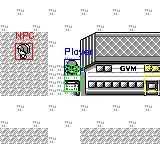

# 🧠 Pokémon Blue AI: Autonomous Agent via Reinforcement Learning & Computer Vision


*Capture du test_inference.py avec détection temps réel des 4 classes*

---

## 📝 Introduction

Ce projet, réalisé dans le cadre de la spécialisation IA chez **Holberton School**, vise à développer un agent autonome capable de jouer à **Pokémon Bleu/Rouge** sur Game Boy.

L'approche est unique : au lieu de fournir l'état de la mémoire (RAM) directement au réseau de neurones (comme un bot classique), cet agent utilise une approche **Vision-Based**. Il "regarde" l'écran via un modèle **YOLOv8** pour comprendre son environnement (Portes, PNJ, Panneaux, ...) et prend des décisions de navigation et de combat via le **Reinforcement Learning**.

| Objectif | Status |
| :--- | :---: |
| **Actuel** | Validation du pipeline Computer Vision (Dataset Synthétique & Détection Temps Réel) |
| **Final** | Partir de la chambre du joueur et vaincre Pierre (Brock), le premier champion d'arène |

---

## 🏗️ Architecture Technique

Le projet repose sur trois piliers d'ingénierie :

### 1. Perception (Computer Vision) ✅ Terminé

Le système de vision ne repose pas sur l'annotation manuelle (trop lente). J'ai développé un **pipeline de Data Engineering automatisé** :

| Étape | Technique | Description |
| :--- | :--- | :--- |
| **Extraction** | Lecture OAM (`0xFE00`) | Récupération des sprites depuis la mémoire vidéo |
| **Clustering** | Algorithme spatial | Regroupement des tuiles 8x8 en entités 16x16 |
| **Calibration** | Calcul dynamique | Compensation du scrolling caméra et effets de bord |

> **Résultat :** Génération de **5000 images annotées** parfaitement en quelques minutes.

**Modèle :** YOLOv8-Nano entraîné sur **4 classes** avec une précision **mAP50 > 99%**.

| Classe | ID | Description |
| :--- | :---: | :--- |
| Player | 0 | Le personnage joueur |
| NPC | 1 | Personnages non-joueurs |
| Door | 2 | Portes et entrées |
| Sign | 3 | Panneaux et boîtes aux lettres |

📖 *Documentation détaillée : [Vision Pipeline](docs/vision_pipeline.md)*

### 2. Interaction (Environment) 🔄 En cours

- Wrapper personnalisé autour de l'émulateur **PyBoy**
- Gestion des entrées/sorties compatible avec l'interface **Gymnasium** (standard RL)
- Optimisation pour **WSL** (Windows Subsystem for Linux) via gestion des drivers audio dummy

📖 *Documentation détaillée : [Architecture](docs/architecture.md)*

### 3. Décision (Brain) 🧠 À venir

- **Orchestrateur :** Machine à états pour gérer les phases (Exploration vs Combat)
- **Agents RL :** PPO/DQN pour la navigation basée sur les inputs visuels de YOLO

📖 *Documentation détaillée : [RAM Map](docs/ram_map.md)*

---

## 🚀 Installation

### Pré-requis

- Python 3.9+
- ROM de Pokémon Blue (US/EU) - *Fichier `PokemonBlue.gb` à placer à la racine*

> ⚠️ **Copyright :** La ROM n'est pas fournie. Vous devez posséder une copie légale du jeu.

### Setup

```bash
# Cloner le repository
git clone https://github.com/MaKSiiMe/PokemonBlueExperiments.git
cd PokemonBlueExperiments

# Créer l'environnement virtuel
python3 -m venv .venv
source .venv/bin/activate  # Linux/Mac
# .venv\Scripts\activate   # Windows

# Installer les dépendances
pip install -r requirements.txt
```

### Note pour les utilisateurs WSL (Linux sur Windows)

Si vous rencontrez des erreurs audio (`ALSA lib...`), lancez les scripts avec cette variable d'environnement :

```bash
SDL_AUDIODRIVER=dummy python3 src/vision/test_inference.py
```

---

## 🛠️ Workflow & Reproduction

Voici comment reproduire le module de Vision étape par étape :

### Étape 1 : Création des Checkpoints

Jouer au jeu et créer des points de sauvegarde variés (`.state`).

```bash
python3 src/utils/create_checkpoints.py
```

### Étape 2 : Génération du Dataset

Le script charge les sauvegardes et génère 5000 images annotées via l'analyse RAM.

```bash
python3 src/vision/generate_dataset.py
```

### Étape 3 : Entraînement YOLO

```bash
# Organisation des dossiers train/val
python3 src/vision/split_data.py

# Lancement du training (GPU recommandé)
python3 train_yolo.py
```

### Étape 4 : Test en Temps Réel

Voir l'IA détecter les objets en jouant.

```bash
python3 src/vision/test_inference.py

# Avec une sauvegarde spécifique
python3 src/vision/test_inference.py [...].state
```

### Étape 5 : Visualisation du Dataset (Debug)

Vérifier la qualité des annotations générées.

```bash
python3 src/vision/visualize_dataset.py
```

---

## 📂 Structure du Projet

```
PokemonBlueExperiments/
│
├── 📁 data/                    # Données brutes (ignoré par git)
│   └── dataset/
│       └── raw/
│           ├── images/         # Screenshots annotés
│           └── labels/         # Fichiers YOLO (.txt)
│
├── 📁 datasets/                # Dataset formaté pour YOLO
│   ├── train/
│   └── val/
│
├── 📁 docs/                    # Documentation technique
│   ├── architecture.md         # Architecture système
│   ├── ram_map.md              # Cartographie mémoire
│   └── vision_pipeline.md      # Pipeline Computer Vision
│
├── 📁 models/                  # Poids entraînés (.pt)
│   └── yolo_pokemon/
│       └── weights/
│           └── best.pt
│
├── 📁 src/
│   ├── 📁 emulator/            # Wrapper PyBoy & Gym Env
│   ├── 📁 utils/               # Outils (Checkpoints, Audit)
│   │   └── create_checkpoints.py
│   └── 📁 vision/              # Pipeline Computer Vision
│       ├── generate_dataset.py # Génération auto du dataset
│       ├── split_data.py       # Split train/val
│       ├── visualize_dataset.py# Debug des annotations
│       └── test_inference.py   # Visualisation temps réel
│
├── 📄 train_yolo.py            # Script d'entraînement
├── 📄 requirements.txt         # Dépendances Python
├── 📄 data.yaml                # Config YOLO (classes)
└── 📄 README.md
```

---

## 📈 Progrès

| Phase | Tâche | Status |
| :--- | :--- | :---: |
| **Infrastructure** | Setup PyBoy et Wrapper Gym de base | ✅ |
| **Reverse Engineering** | Cartographie RAM (Coordonnées, Map ID, OAM, Scroll) | ✅ |
| **Data Engineering** | Script de génération de dataset (V7 - Calibration Dynamique) | ✅ |
| **Computer Vision** | Entraînement YOLOv8 (mAP50 > 99% sur 4 classes) | ✅ |
| **Navigation Agent** | Implémentation de l'agent RL pour l'Overworld | 🔄 |
| **Battle Agent** | Implémentation de la logique de combat | ⏳ |
| **Intégration Finale** | Battre Pierre (Brock) | ⏳ |

---

## 📚 Documentation

| Document | Description |
| :--- | :--- |
| [Architecture](docs/architecture.md) | Diagramme système et flux de données |
| [RAM Map](docs/ram_map.md) | Adresses mémoires utilisées |
| [Vision Pipeline](docs/vision_pipeline.md) | Détails du Data Engineering et YOLO |

---

## 🔗 Liens Utiles

- **PyBoy :** [GitHub](https://github.com/Baekalfen/PyBoy) - Émulateur Game Boy en Python
- **Ultralytics YOLO :** [Documentation](https://docs.ultralytics.com/) - Framework de détection d'objets
- **Pokémon Disassembly :** [pret/pokered](https://github.com/pret/pokered) - Référence pour le reverse engineering

---

## 👤 Auteur

**Maxime** - Étudiant en spécialisation Machine Learning @ Holberton School

[](https://github.com/MaKSiiMe)
