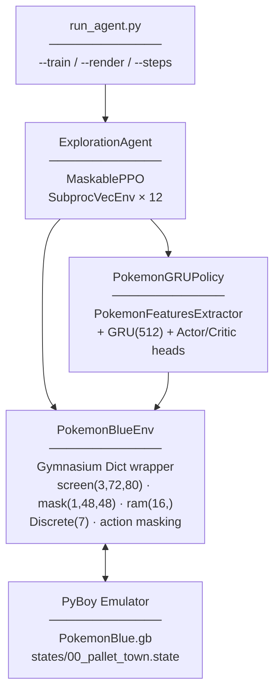

# Pokémon Blue AI — Autonomous RL Agent

An autonomous AI agent that learns to play Pokémon Blue (Game Boy, 1996) and earn the first gym badge (Brock, Pewter City), using Reinforcement Learning with a hybrid observation space: raw screen pixels + a visit map + structured RAM values.

---

## Overview

The agent perceives the game through a **Dict observation space** combining three modalities:

- **Screen** — 3 stacked grayscale frames (72×80) processed by a NatureDQN CNN
- **Visited mask** — binary 48×48 grid of tiles visited this episode
- **RAM vector** — 16 normalized scalars extracted directly from Game Boy memory

It acts over a **Discrete(7) action space** and is trained end-to-end with **MaskablePPO** (sb3-contrib) using a custom recurrent policy (`PokemonGRUPolicy`). Action masking prevents illegal inputs during battles and transitions.

> **Final objective:** Start from Prof. Oak's lab and defeat Brock (Stone Badge).

---

## Why hybrid obs, not pure RAM?

The original approach was vision-based (YOLOv8 trained on Game Boy screenshots, mAP50 > 99%), but the dataset was built from tilesets that didn't match real gameplay renders and didn't generalize. A pure RAM approach was the MVP pivot.

The current architecture combines both: **CNN on raw screen pixels** (spatial reasoning, sprite detection without annotation) + **RAM scalars** (exact HP, battle status, map ID, badges) + **visit mask** (cross-episode memory of explored tiles).

---

## Architecture



### Policy architecture

```
screen (3, 72, 80)      → NatureDQN CNN (3 conv) → 512
visited_mask (1, 48, 48)→ LightCNN    (2 conv)   → 256   → concat (1024) → GRU(512) → Actor head (7)
ram (16,)               → MLP 2×256              → 256                              → Critic head (1)
```

---

## Observation Space

### `screen` — (3, 72, 80) float32 [0, 1]

3 grayscale frames stacked temporally. Each frame is the Game Boy screen (144×160) downsampled ×2 → 72×80, converted to luminance, normalized to [0, 1].

### `visited_mask` — (1, 48, 48) float32 {0, 1}

Binary 48×48 grid centered on the player. `1` = tile `(map_id, x, y)` visited in the current or a previous episode. Persists across episode resets for cross-episode memory.

### `ram` — (16,) float32 [0, 1]

| Index | Variable | RAM Address | Normalization |
| :---: | :--- | :--- | :--- |
| 0 | Player X | `0xD362` | `/ 255` |
| 1 | Player Y | `0xD361` | `/ 255` |
| 2 | Map ID | `0xD35E` | `/ 255` |
| 3 | Direction | `0xD35D` | `{0, 0.33, 0.66, 1}` |
| 4 | HP % | `0xD16C-D / 0xD18C-D` | ratio |
| 5 | Battle status | `0xD057` | `/ 2` (0=overworld, 0.5=wild, 1=trainer) |
| 6 | Event flags % | `0xD747` (32 bytes) | set bits / total |
| 7 | Steps stuck | internal counter | `/ 100`, clipped [0,1] |
| 8 | Badges | `popcount(0xD356)` | `/ 8` |
| 9 | Type advantage | best SE multiplier available | `/ 4` |
| 10 | Enemy can evolve | KG lookup | 0 or 1 |
| 11 | Zone Pokémon density | KG encounters | `/ 8` |
| 12 | Active battle mon HP % | `0xD015 / 0xD023` | ratio |
| 13 | Pokédex owned % | `0xD2F7` bitmask | `/ 151` |
| 14 | Money | BCD `0xD347-D349` | `/ 999999` |
| 15 | Bag items | `0xCF7B` | `/ 20` |

---

## Action Space

`Discrete(7)` — actions are held for 24 ticks (~0.4 s game time, one full movement animation):

| Index | Action |
| :---: | :--- |
| 0 | Up |
| 1 | Down |
| 2 | Left |
| 3 | Right |
| 4 | A |
| 5 | B |
| 6 | Start |

Action masking disables movement and Start during battles; disables A if all moves are immunized against the enemy.

---

## Reward Signal

Six independently tracked components (logged in TensorBoard under `reward/`):

| Component | Signal |
| :--- | :--- |
| `r_map` | +1.0 per new map, ×2 bonus for optimal-path zones, +5.0 one-shot for leaving the lab |
| `r_tile` | +0.5 per new tile globally, −0.05 after 600 visits to the same tile |
| `r_level` | delta of piecewise-linear level sum (full rate < 15, ÷4 above) |
| `r_event` | +2.0 per new event flag, +50.0 per badge |
| `r_heal` | proportional HP gained / max HP × 2.0 (overworld only), −1.0 on death |
| `r_type` | +0.1 / +0.2 for SE / double-SE move used in battle |

---

## Training

### Two-phase schedule

| Phase | `max_steps/ep` | Purpose |
| :--- | :--- | :--- |
| Phase 1 (exploration) | 8 000 | Wide exploration from Pallet Town |
| Phase 2 (fine-tune) | 2 000 | Shorter episodes, sharper policy |

### Key hyperparameters

| Parameter | Value | Rationale |
| :--- | :--- | :--- |
| `n_envs` | 12 | Calibrated for 12 GB WSL2 RAM (12 × ~400 MB PyBoy) |
| `n_steps` | 2048 | Rollout buffer per env |
| `n_epochs` | 3 | Avoids KL explosion on large rollouts |
| `gamma` | 0.997 | Longer horizon for sparse RPG rewards |
| `ent_coef` | 0.02 | Maintains exploration longer |
| `TICKS_PER_ACTION` | 24 | One full movement animation at 60 fps |

---

## Quick Start

### Prerequisites

- Python 3.12
- A legally obtained Pokémon Blue ROM (`ROMs/PokemonBlue.gb`) — **not distributed with this repo**

### Install

```bash
git clone https://github.com/MaKSiiMe/PokemonBlueExperiments.git
cd PokemonBlueExperiments
python3 -m venv .venv
source .venv/bin/activate
pip install -r requirements.txt
```

### Train

```bash
# Default: 500k steps, 12 envs, headless
python run_agent.py --train

# Quick validation run (10k steps, single env)
python run_agent.py --train --steps 10000 --n-envs 1

# With SDL2 window
python run_agent.py --train --steps 500000 --render

# Load a checkpoint and continue
python run_agent.py --train --model models/rl_checkpoints/checkpoint_250000.zip
```

### Inference

```bash
python run_agent.py --render --model models/rl_checkpoints/final.zip
```

### Monitor

```bash
tensorboard --logdir logs/exploration/
```

---

## Progress

| Phase | Description | Status |
| :--- | :--- | :---: |
| 0 | Environment & infrastructure (Gym wrapper, RAM map, save states) | ✅ |
| 1 | Hybrid obs space: screen CNN + visited mask + RAM vector | ✅ |
| 2 | Reward shaping (6 components, action masking) | ✅ |
| 3 | MaskablePPO + PokemonGRUPolicy (CNN+GRU actor-critic) | ✅ |
| 4 | Knowledge graph (type chart, Pokédex, zone encounters) | ✅ |
| 5 | Monitoring (TensorBoard, GIF recorder, reward breakdown) | ✅ |
| 6 | End-to-end run: Pallet Town → Stone Badge | ⏳ training |
| 7 | *(Future)* Go-Explore archive for hard exploration | ⏳ |

---

## Project Structure

```
PokemonBlueExperiments/
├── run_agent.py                  # Main entry point
├── ROMs/PokemonBlue.gb           # ROM (not versioned)
├── states/
│   └── 00_pallet_town.state      # Start: starter received, Pokédex obtained
├── models/rl_checkpoints/        # Trained MaskablePPO models (.zip)
├── logs/
│   ├── exploration/              # TensorBoard logs
│   └── videos/                   # GIF recordings (VideoRecorderCallback)
├── src/
│   ├── emulator/
│   │   ├── pokemon_env.py        # Gymnasium Dict environment
│   │   └── ram_map.py            # RAM addresses (single source of truth)
│   ├── agent/
│   │   ├── exploration_agent.py  # MaskablePPO training orchestration
│   │   ├── custom_policy.py      # PokemonGRUPolicy + PokemonFeaturesExtractor
│   │   ├── monitoring.py         # GameMetricsCallback (TensorBoard)
│   │   ├── video_callback.py     # VideoRecorderCallback (GIF)
│   │   ├── battle_agent.py       # Heuristic combat agent (future integration)
│   │   ├── go_explore.py         # Go-Explore archive (future)
│   │   ├── orchestrator.py       # RAM state machine
│   │   └── vectorization.py      # SubprocVecEnv helpers
│   ├── knowledge/
│   │   ├── graph.py              # PokemonKnowledgeGraph
│   │   ├── builder.py            # Graph construction from gen1_data
│   │   └── gen1_data.py          # Type chart, move types, Pokédex
│   └── utils/
│       ├── create_checkpoints.py # Save state tool
│       └── debug_visualizer.py   # Live RAM overlay
├── test_battle.py                # Battle agent integration test
└── docs/
    ├── stage1_report.md
    ├── stage2_charter.md
    ├── stage3_technical.md
    ├── stage4_mvp.md
    └── ram_map.md
```

---

## Tech Stack

| Technology | Role |
| :--- | :--- |
| [PyBoy 2.6.1](https://github.com/Baekalfen/PyBoy) | Game Boy emulator — runs the ROM, exposes RAM and screen |
| [Stable Baselines3](https://stable-baselines3.readthedocs.io/) | PPO base, SubprocVecEnv, CheckpointCallback |
| [sb3-contrib](https://sb3-contrib.readthedocs.io/) | MaskablePPO, MaskableActorCriticPolicy |
| [Gymnasium](https://gymnasium.farama.org/) | Standard RL environment interface (Dict obs) |
| [PyTorch](https://pytorch.org/) | CNN + GRU neural network backend |
| [TensorBoard](https://www.tensorflow.org/tensorboard) | Training curve visualization |
| [imageio](https://imageio.readthedocs.io/) | GIF recording for visual debugging |

---

## Author

**Maxime** — Machine Learning specialization @ Holberton School

[](https://github.com/MaKSiiMe)
[](https://www.linkedin.com/in/maxime-truel/)
