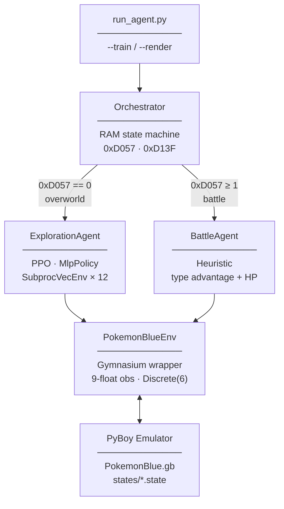

# Pokémon Blue AI — Autonomous RL Agent

An autonomous AI agent that learns to play Pokémon Blue (Game Boy, 1996) and earn the first gym badge, using Reinforcement Learning with raw Game Boy RAM as its sole perception of the world.

---

## Overview

The agent receives no visual input. It perceives the game exclusively through **9 RAM values** extracted from the emulator at each step, and learns to navigate from Pallet Town to Pewter Gym using **Proximal Policy Optimization (PPO)** with curriculum learning.

Battles are handled by a separate **rule-based heuristic agent** that reads type data and HP directly from RAM — no RL required for combat decisions.

> **Final objective:** Start from the player's room and defeat Brock, Pewter City's Gym Leader.

---

## Why RAM, not Vision?

The original approach was **vision-based** — a YOLOv8 model trained on Game Boy screenshots to detect sprites (player, NPCs, doors, signs). That model reached **mAP50 > 99%**, but the dataset was built from a tileset that didn't match real gameplay renders. The model didn't generalize.

Rather than rebuild the dataset, I pivoted to a **RAM-only approach** for the MVP:
- Observations are exact (no noise from image processing)
- Training is drastically faster (9 floats vs. convolutional processing)
- Every value is directly interpretable and debuggable

A vision module (YOLOv8 feature extractor feeding into PPO) is planned as a future enhancement once the end-to-end RAM-only run is complete.

---

## Architecture



---

## Observation Space

| Index | Variable | RAM Address | Normalization |
| :---: | :--- | :--- | :--- |
| 0 | Player X | `0xD362` | `/ 255` |
| 1 | Player Y | `0xD361` | `/ 255` |
| 2 | Map ID | `0xD35E` | `/ 255` |
| 3 | Direction | `0xD35D` | `{0, 0.33, 0.66, 1}` |
| 4 | HP % | `0xD16C-D / 0xD18C-D` | ratio |
| 5 | Battle status | `0xD057` | `/ 2` |
| 6 | Waypoint X | current target | `/ 255` |
| 7 | Waypoint Y | current target | `/ 255` |
| 8 | Badges | `popcount(0xD356)` | `/ 8` |

---

## Curriculum Learning

Training is split across **17 waypoints** from the starting room to Brock's gym. Each waypoint has a pre-recorded save state so training can start from any point in the game.

Each waypoint uses **two-phase training:**
1. **Exploration phase** (`max_steps × 5`) — agent discovers the target area
2. **Fine-tune phase** (`max_steps`) — agent optimizes the path

```
Pallet Town → Route 1 → Viridian City → Route 2 → Viridian Forest → Pewter City → Pewter Gym (Brock)
```

---

## Quick Start

### Prerequisites

- Python 3.11
- A legally obtained Pokémon Blue ROM (`ROMs/PokemonBlue.gb`) — **not distributed with this repo**

### Install

```bash
git clone https://github.com/MaKSiiMe/PokemonBlueExperiments.git
cd PokemonBlueExperiments
python3 -m venv .venv
source .venv/bin/activate
pip install -r requirements.txt
```

### Train

```bash
# Train a single waypoint
python run_agent.py --train --wp 0

# Train with chained waypoints (single episode)
python run_agent.py --train --chain 0 1

# Chain-train the full curriculum from WP0
python run_agent.py --train --chain-all
```

### Run Inference (with visual overlay)

```bash
python run_agent.py --render --model models/final.zip
```

---

## Progress

| Phase | Description | Status |
| :--- | :--- | :---: |
| 0 | Environment & infrastructure (Gym wrapper, RAM map, save states, debug overlay) | ✅ |
| 1 | Reward shaping (distance, zone, stuck, death, badges, events) | ✅ |
| 2 | Orchestrator state machine | ✅ coded / ⏳ validated |
| 3 | Navigation agent — full curriculum (17 waypoints) | 🔄 WP0–1 done |
| 4 | Battle heuristic agent | ✅ coded / ⏳ validated |
| 5 | End-to-end run: Pallet Town → Badge Brock | ⏳ |
| 6 | Documentation & portfolio | 🔄 |
| 7 | *(Future)* Vision module — YOLOv8 + CnnPolicy | ⏳ |

---

## Project Structure

```
PokemonBlueExperiments/
├── run_agent.py                  # Main entry point
├── ROMs/PokemonBlue.gb           # ROM (not versioned)
├── states/                       # PyBoy save states (curriculum waypoints)
├── models/rl_checkpoints/        # Trained PPO models (.zip)
├── logs/                         # TensorBoard logs
├── src/
│   ├── emulator/
│   │   ├── pokemon_env.py        # Gymnasium environment
│   │   └── ram_map.py            # All RAM addresses (single source of truth)
│   ├── agent/
│   │   ├── exploration_agent.py  # PPO + curriculum
│   │   ├── battle_agent.py       # Heuristic combat agent
│   │   ├── orchestrator.py       # State machine
│   │   └── waypoints.py          # Curriculum definition (single source of truth)
│   └── utils/
│       ├── create_checkpoints.py # Save state tool (--auto / --manual)
│       └── debug_visualizer.py   # Live RAM overlay
├── test_battle.py                # Battle agent integration test
└── docs/
    ├── stage1_report.md          # Team formation & idea development
    ├── stage2_charter.md         # Project charter
    ├── stage3_technical.md       # Technical documentation
    ├── stage4_mvp.md             # Sprint plan & progress
    ├── architecture.md           # Architecture detail
    ├── roadmap.md                # Task tracking
    └── ram_map.md                # RAM address reference
```

---

## Documentation

| Document | Description |
| :--- | :--- |
| [Stage 1 — Team & Idea](docs/stage1_report.md) | Ideas explored, MVP concept, decision rationale |
| [Stage 2 — Project Charter](docs/stage2_charter.md) | Objectives, scope, risks, timeline |
| [Stage 3 — Technical Docs](docs/stage3_technical.md) | Architecture, components, sequence diagrams, APIs |
| [Stage 4 — MVP Development](docs/stage4_mvp.md) | Sprint plans, progress, bug tracker |
| [Architecture](docs/architecture.md) | System architecture detail |
| [RAM Map](docs/ram_map.md) | All Game Boy RAM addresses used |
| [Roadmap](docs/roadmap.md) | Phase-by-phase task tracking |

---

## Tech Stack

| Technology | Role |
| :--- | :--- |
| [PyBoy 2.6.1](https://github.com/Baekalfen/PyBoy) | Game Boy emulator — runs the ROM, exposes RAM |
| [Stable Baselines3](https://stable-baselines3.readthedocs.io/) | PPO implementation, SubprocVecEnv, CheckpointCallback |
| [Gymnasium](https://gymnasium.farama.org/) | Standard RL environment interface |
| [PyTorch](https://pytorch.org/) | Neural network backend |
| [TensorBoard](https://www.tensorflow.org/tensorboard) | Training curve visualization |

---

## Author

**Maxime** — Machine Learning specialization @ Holberton School

[](https://github.com/MaKSiiMe)
[](https://www.linkedin.com/in/maxime-truel/)
