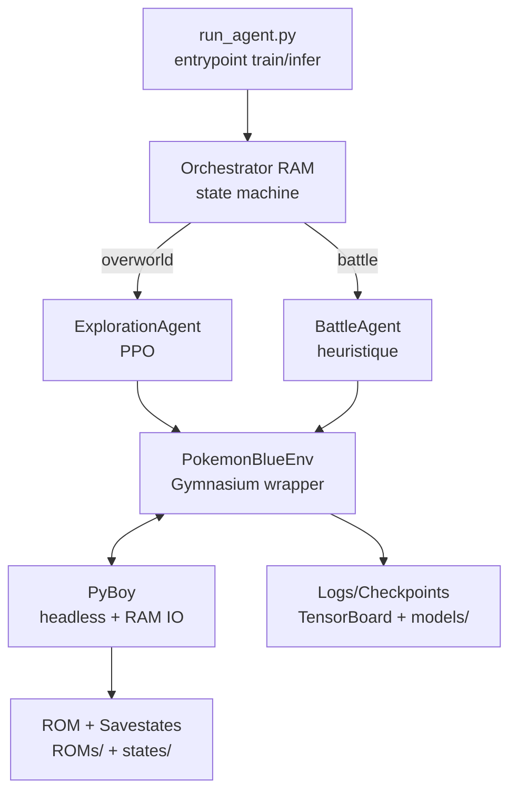
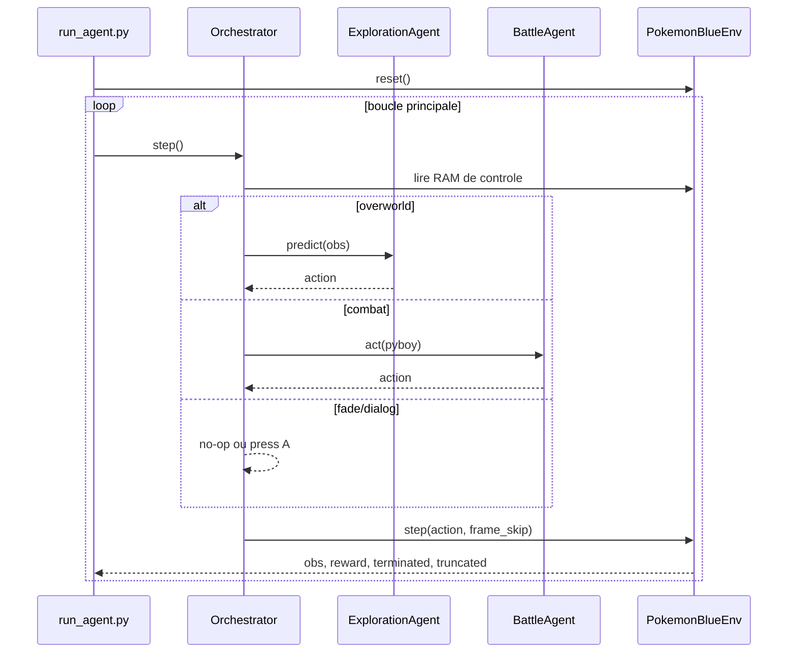

# Architecture et Pipeline Technique DRL - Pokemon Gen1

Ce document consolide deux niveaux:

- l'architecture actuellement implementee dans ce repo (Pokemon Blue, RAM-first),
- l'architecture cible de recherche pour resoudre Pokemon Rouge/Bleu a grande echelle via DRL.

L'environnement est traite comme un POMDP (Partially Observable Markov Decision Process):

- horizon tres long (dizaines de milliers d'actions pour un milestone),
- recompenses clairsemees,
- etat cache important (flags, inventaire, progression),
- transitions stochastiques (RNG combat, rencontres, dialogues).

---

## 1. Vue d'ensemble



Version actuelle: stack SB3 + SubprocVecEnv, observation compacte RAM (9 floats), action space Discrete(6).

Pipeline cible: observation hybride (pixels + RAM + visited mask), politique recurrente (GRU), exploration archivee type Go-Explore, parallelisation renforcee (PufferLib ou equivalent shared memory).

---

## 2. Environnement de simulation

### 2.1 Emulateur PyBoy

PyBoy est retenu pour:

- controle programmatique des inputs,
- lecture/ecriture RAM directe via `pyboy.memory[address]`,
- gestion native des savestates,
- mode headless performant pour RL massif.

### 2.2 Encapsulation Gymnasium

`src/emulator/pokemon_env.py` suit l'interface standard:

- `__init__()`: ROM, espaces math, config reset/steps,
- `reset()`: chargement d'un etat initial (savestate),
- `step(action)`: action, ticks emulation, reward shaping, `terminated/truncated`,
- `render()`: frame image si necessaire (debug/monitoring).

### 2.3 Horloge, headless et frame skipping

- emulation desacouplee du temps reel (`set_emulation_speed(0)`),
- rendu graphique minimise en entrainement,
- frame skip aligne sur la logique tile (valeur de reference: 24 ticks).

L'execution d'une action suit le schema: appui touche -> 1 tick -> relache touche -> ticks restants.

---

## 3. Espace d'observation

## 3.1 Baseline actuelle (repo)

Observation vectorielle normalisee en 9 floats:

| Index | Variable | Source RAM |
| :---: | :--- | :--- |
| 0 | `player_x` | `0xD362 / 255` |
| 1 | `player_y` | `0xD361 / 255` |
| 2 | `map_id` | `0xD35E / 255` |
| 3 | `direction` | `0xD35D -> {0, 0.33, 0.66, 1}` |
| 4 | `hp_pct` | `0xD16C-D / 0xD18C-D` |
| 5 | `battle_status` | `0xD057 / 2` |
| 6 | `waypoint_x` | cible X / 255 |
| 7 | `waypoint_y` | cible Y / 255 |
| 8 | `badges_pct` | `popcount(0xD356) / 8` |

### 3.2 Espace cible hybride (recherche)

Le design recommande `gymnasium.spaces.Dict`:

- `screen`: image grayscale downsamplee (ex: 72x80),
- `frames`: frame stacking temporel (ex: 3 frames),
- `visited_mask`: carte binaire locale des tuiles deja visitees,
- `ram_vector`: vecteur semantique dense decode depuis la RAM.

Contraintes memoire GPU (RTX 3060 6 Go):

- stocker les observations en `uint8` cote CPU et convertir en `float32/float16` uniquement au dernier moment,
- exploiter la palette 2 bits de la Game Boy pour packer 4 pixels par octet lors du buffering CPU,
- decompresser juste avant passage CNN, ce qui reduit fortement la pression VRAM et le trafic hote -> GPU.

Point critique de conception du `visited_mask`:

- le masque doit etre indexe par `map_id` (dictionnaire `map_id -> mask`) et non global,
- les coordonnees X/Y se recouvrent entre cartes; sans partition par carte, l'agent confond des zones differentes.

### 3.3 Variables RAM critiques a exposer

Le mapping exact varie entre Red/Blue selon les banques/adresses; la table ci-dessous decrit les familles de variables a integrer:

- map id + coordonnees joueur,
- HP actuels/max et statuts d'alteration,
- niveaux de l'equipe,
- inventaire (items + quantites),
- argent (decode BCD),
- progression Pokedex,
- event flags de quete (badges, PNJ, triggers).

Ce couplage vision + RAM evite les faux signaux purement visuels et rend la progression mesurable semantiquement.

---

## 4. Espace d'actions

### 4.1 Etat actuel

`Discrete(6)`: `up`, `down`, `left`, `right`, `a`, `b`.

### 4.2 Extension cible

Choix retenu pour la convergence: conserver `Discrete(6)` (`up`, `down`, `left`, `right`, `a`, `b`).

- `select` est exclu de maniere definitive (gain fonctionnel marginal, cout d'exploration non negligeable),
- `start` peut rester gere par logique script/orchestrateur dans des cas rares, au lieu d'etre expose a la politique stochastique.

---

## 5. Architecture modele

### 5.1 Actuel

Politique PPO `MlpPolicy` sur observation RAM compacte.

### 5.2 Cible multimodale recurrente

- encodeur CNN pour l'ecran,
- encodeur CNN leger pour `visited_mask`,
- encodeur MLP (2x256 ReLU) pour le vecteur RAM,
- fusion par concatenation,
- couche recurrente GRU (hidden size ~512),
- deux tetes actor-critic:
  - policy head `pi_theta(a|s,h)`,
  - value head `V_phi(s,h)`.

Choix GRU: compromis favorable entre cout memo/compute et retention temporelle sur longs episodes.

---

## 6. Algorithme RL et exploration

### 6.1 PPO comme base

Objectif clippe:

$$
L_{CLIP}(\theta)=\hat{\mathbb{E}}_t\left[\min\left(r_t(\theta)\hat{A}_t,\text{clip}(r_t(\theta),1-\epsilon,1+\epsilon)\hat{A}_t\right)\right]
$$

avec:

$$
r_t(\theta)=\frac{\pi_\theta(a_t|s_t)}{\pi_{\theta_{old}}(a_t|s_t)}
$$

et `GAE` pour estimer `A_t`.

### 6.2 Exploration dure type Go-Explore

Les bonus de curiosite seuls ne suffisent pas sur Pokemon (detachment, noisy TV).

Pipeline cible:

- archive de cellules semantiques (map_id, x, y),
- sauvegarde savestate associee a chaque cellule,
- redemarrage d'episodes depuis cellules frontieres,
- expansion iterative de l'archive au lieu d'un reset systematique debut de jeu.

---

## 7. Reward shaping

La recompense totale agrege plusieurs termes:

$$
R_{total}=R_{event}+R_{nav}+R_{heal}+R_{level}+R_{combat}+R_{safety}
$$

### 7.1 Signaux actuellement implementes

- pas de base negatif,
- shaping distance waypoint,
- bonus nouvelle map,
- bonus waypoint intermediaire,
- penalite stagnation,
- penalite mort,
- bonus niveau adversaire vaincu.

### 7.2 Signaux recommandes pour l'echelle complete

- `R_event`: event flags critiques (Pokedex, badges, milestones),
- `R_nav`: nouveaute stricte par tuile `(map,x,y)`,
- `R_heal`: survie/equipe restauree,
- `R_level`: progression avec rendement decroissant pour limiter le grind.

Exemple affine par morceaux inspire des retours de terrain:

$$
R_{level}=\begin{cases}
\sum_{i=1}^{6} level_i, & \text{si } \sum level_i < 15 \\
30 + \frac{\sum_{i=1}^{6} level_i - 15}{4}, & \text{sinon}
\end{cases}
$$

### 7.3 Garde-fous anti reward hacking

- gerer explicitement le cas depot PC (ne pas creer une punition catastrophique artificielle),
- plafonner/decroitre les micro-recompenses d'interaction repetitive,
- ne pas baser la nouveaute sur des pixels animes stochastiques.

Implementation recommandee pour le cas PC Trauma:

- neutraliser uniquement la composante negative de `delta(R_level)` si la transition precedente est detectee sur une tuile PC d'un Centre Pokemon (contexte map + coordonnees + etat menu depot),
- conserver la penalite negative de `delta(R_level)` dans les autres contextes (defaite en combat, attrition normale) pour ne pas biaiser l'objectif de survie.

---

## 8. Orchestration de jeu (inference)

`src/agent/orchestrator.py` route les decisions selon la RAM:

```text
0xD13F != 0  -> attendre (fade)
0xD11C != 0  -> auto-skip dialogue (A)
0xD057 == 0  -> ExplorationAgent (overworld)
0xD057 >= 1  -> BattleAgent (combat)
```



---

## 9. Infrastructure et parallelisation

### 9.1 Actuel

- `SubprocVecEnv x12`,
- checkpoints PPO dans `models/rl_checkpoints/`,
- logs TensorBoard dans `logs/exploration/`.

### 9.2 Cible de scaling

- cible generale: 32 a 96 environnements sur station de travail CPU riche,
- profil materiel actuel (Ryzen 5 5600H): viser d'abord 12 a 24 environnements stables puis augmenter progressivement,
- vectorisation shared-memory (PufferLib ou backend equivalent),
- throughput vise: 10k-30k SPS selon materiel,
- rollout buffer long (2048-4096 steps/env) pour PPO recurrent.

---

## 10. Monitoring critique

Suivre en continu:

- entropy policy,
- value loss,
- SPS,
- nombre de `map_id` uniques,
- niveau max equipe,
- taux de milestones (ex: Pallet -> Viridian -> Pewter -> Badge).

---

## 11. Etat actuel vs feuille de route

| Domaine | Etat repo | Cible |
| :--- | :--- | :--- |
| Observations | RAM 9 floats | Dict hybride (pixels + RAM + visited mask) |
| Politique | PPO MLP | PPO Actor-Critic avec GRU |
| Actions | Discrete(6) | Discrete(6) conserve, Start scriptable |
| Exploration | waypoints + shaping | archive semantique type Go-Explore |
| Parallelisation | 12 envs | 12-24 (Ryzen 5600H) puis scaling |
| Reward anti-hack | partiel | garde-fous PC/casino/noisy visual novelty |

---

## 12. Modules et fichiers

- `src/emulator/pokemon_env.py`: wrapper Gymnasium/PyBoy, observation/reward/step.
- `src/agent/exploration_agent.py`: PPO training/inference + curriculum waypoints.
- `src/agent/battle_agent.py`: heuristique combat Gen1 (types, HP, potion).
- `src/agent/orchestrator.py`: machine a etats RAM (overworld/combat/dialog/fade).
- `src/utils/create_checkpoints.py`: pipeline savestates auto ou manuel.
- `src/utils/debug_visualizer.py`: overlay debug RAM en temps reel.

---

## Documents lies

| Document | Description |
| :--- | :--- |
| [ram_map.md](ram_map.md) | adresses memoire et decode |
| [roadmap.md](roadmap.md) | priorites implementation |
| [stage4_mvp.md](stage4_mvp.md) | objectifs MVP et criteres |
