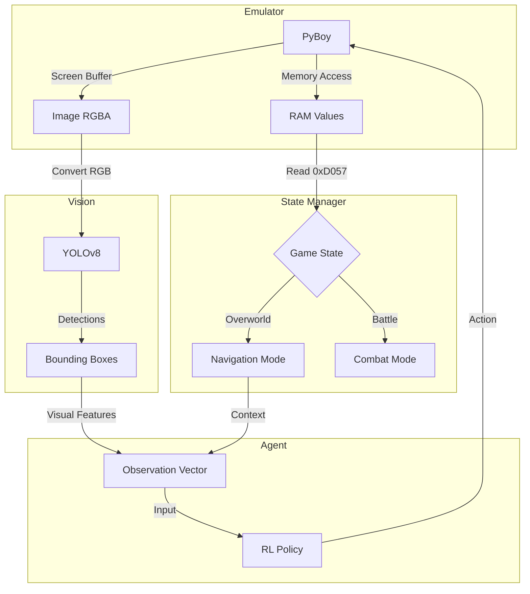

# 🏗️ System Architecture

Ce document décrit l'architecture logicielle globale du projet **Pokémon Blue AI**.
Le système est conçu de manière modulaire pour séparer la perception (Vision), la logique de jeu (Emulator) et la prise de décision (Agent).

---

## 🧩 Diagramme Global



---

## 📦 Modules

### 1. Emulator Interface (`src/emulator/`)

Ce module gère l'interaction bas niveau avec la ROM via **PyBoy**.

| Composant | Fichier | Description |
| :--- | :--- | :--- |
| Core Wrapper | `emulator.py` | Abstraction PyBoy |
| Gym Environment | `pokemon_env.py` | Interface Gymnasium |

**Fonctionnalités :**

- **Rôle :** Exécuter le jeu, gérer le temps (Tick), et fournir l'accès brut à la mémoire et à l'écran.
- **Optimisation WSL :** Gestion spécifique des drivers audio (`dummy`) pour éviter les crashs de buffer sous Linux/Windows Subsystem.
- **Abstraction :** Fournit une API simplifiée :

```python
class PokemonEnv:
    def reset(self) -> Observation
    def step(self, action: int) -> (Observation, Reward, Done, Info)
    def get_screen(self) -> np.ndarray
```

### 2. Vision Module (`src/vision/`)

C'est les **"yeux"** de l'IA. Ce module ne dépend pas de la RAM pour l'inférence, uniquement des pixels.

| Composant | Fichier | Description |
| :--- | :--- | :--- |
| Dataset Generator | `generate_dataset.py` | Création automatique des données |
| Data Splitter | `split_data.py` | Organisation train/val |
| Visualizer | `visualize_dataset.py` | Debug des annotations |
| Inference | `test_inference.py` | Test temps réel |

**Caractéristiques :**

- **Modèle :** YOLOv8-Nano (Custom trained)
- **Input :** Frame brute (160x144x3)
- **Output :** Liste de détections sémantiques :

| Classe | ID | Usage Agent |
| :--- | :---: | :--- |
| Player | 0 | Position actuelle |
| NPC | 1 | Obstacles / Interactions |
| Door | 2 | Objectifs de navigation |
| Sign | 3 | Points d'information |

**Utilité :** Permet à l'agent de naviguer vers des objectifs visibles sans connaître la carte mémoire du jeu à l'avance.

📖 *Documentation complète : [Vision Pipeline](vision_pipeline.md)*

### 3. Brain & Decision (`src/agent/` - En développement)

Le cerveau est divisé en sous-systèmes spécialisés gérés par un **Orchestrateur**.

#### A. The Orchestrator (State Machine)

Il lit la RAM (adresse `0xD057`) pour déterminer le contexte actuel et activer l'agent approprié :

```
┌──────────────────────────────────────────────┐
│                 ORCHESTRATOR                 │
│                                              │
│  ┌─────────┐    ┌─────────┐    ┌─────────┐   │
│  │Overworld│    │ Battle  │    │  Menu   │   │
│  │  Agent  │    │  Agent  │    │ Handler │   │
│  └────▲────┘    └────▲────┘    └────▲────┘   │
│       │              │              │        │
│       └──────────────┼──────────────┘        │
│                      │                       │
│                [RAM: 0xD057]                 │
│                                              │
│  0 = Overworld  │  1 = Wild  │  2 = Trainer  │
└──────────────────────────────────────────────┘
```

| État RAM | Mode | Agent Activé |
| :---: | :--- | :--- |
| 0 | Overworld | Navigation Agent |
| 1 | Wild Battle | Battle Agent |
| 2 | Trainer Battle | Battle Agent |
| *autre* | Menu/Dialog | Script Handler |

#### B. Navigation Agent (PPO/DQN)

- **Objectif :** Atteindre la porte ou la ville suivante.
- **Observation :** Vecteur construit à partir des sorties YOLO :
  ```python
  obs = [
      player_x, player_y,           # Position joueur
      nearest_door_dx, nearest_door_dy,  # Vecteur vers porte
      nearest_npc_dx, nearest_npc_dy,    # Vecteur vers NPC
      # ...
  ]
  ```
- **Reward Function :** Basée sur la réduction de la distance vers la cible.

#### C. Battle Agent (Heuristic/RL)

- **Objectif :** Gagner le combat.
- **Observation :** PV Joueur, PV Ennemi, Type de Pokémon.
- **Action :** Choisir l'attaque la plus efficace (Table des types).

---

## 🔄 Flux de Données (Game Loop)

Une itération complète ("Step") se déroule ainsi :

```
┌───────────────────────────────────────────────────────┐
│                    GAME LOOP                          │
│                                                       │
│  1. TICK          PyBoy avance de N frames            │
│       │                                               │
│       ▼           ┌─────────────┬─────────────┐       │
│  2. SENSING       │ Screen→YOLO │ RAM→State   │       │
│       │           │ "Door right"│ "Overworld" │       │
│       │           └─────────────┴─────────────┘       │
│       ▼                                               │
│  3. DECISION      Agent reçoit observation            │
│       │           Policy output: "RIGHT"              │
│       ▼                                               │
│  4. ACTUATION     pyboy.button("right")               │
│       │                                               │
│       ▼                                               │
│  5. FEEDBACK      Reward = Δ distance                 │
│                   Update agent memory                 │
│                                                       │
└───────────────────────────────────────────────────────┘
```

### Détail des étapes :

| Étape | Action | Détail |
| :--- | :--- | :--- |
| **1. Tick** | Émulation | L'émulateur avance de X frames (ex: 4-5 frames par step) |
| **2. Sensing** | Perception | Capture image → YOLO détecte les objets. Lecture RAM → Détermine l'état |
| **3. Decision** | Inférence | L'agent RL reçoit le vecteur d'observation et produit une action |
| **4. Actuation** | Input | L'action est envoyée à PyBoy (`up`, `down`, `left`, `right`, `a`, `b`) |
| **5. Feedback** | Apprentissage | Calcul de la récompense, mise à jour de la mémoire |

---

## 🗂️ Organisation des Fichiers

```
src/
├── emulator/
│   ├── __init__.py
│   ├── emulator.py          # Wrapper PyBoy bas niveau
│   └── pokemon_env.py       # Gymnasium Environment
│
├── vision/
│   ├── __init__.py
│   ├── generate_dataset.py  # Data Engineering
│   ├── split_data.py        # Train/Val split
│   ├── visualize_dataset.py # Debug tool
│   └── test_inference.py    # Real-time demo
│
├── agent/                   # (En développement)
│   ├── __init__.py
│   ├── orchestrator.py      # State machine
│   ├── nav_agent.py         # Navigation RL
│   └── battle_agent.py      # Combat logic
│
└── utils/
    ├── __init__.py
    └── create_checkpoints.py # Save state generator
```

---

## 📚 Documents Liés

| Document | Description |
| :--- | :--- |
| [RAM Map](ram_map.md) | Adresses mémoires détaillées |
| [Vision Pipeline](vision_pipeline.md) | Data Engineering & YOLO |

