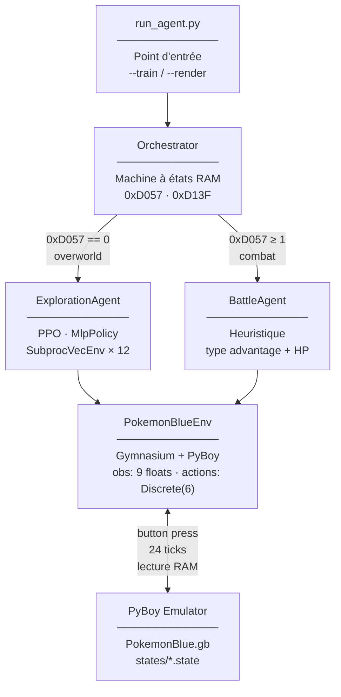
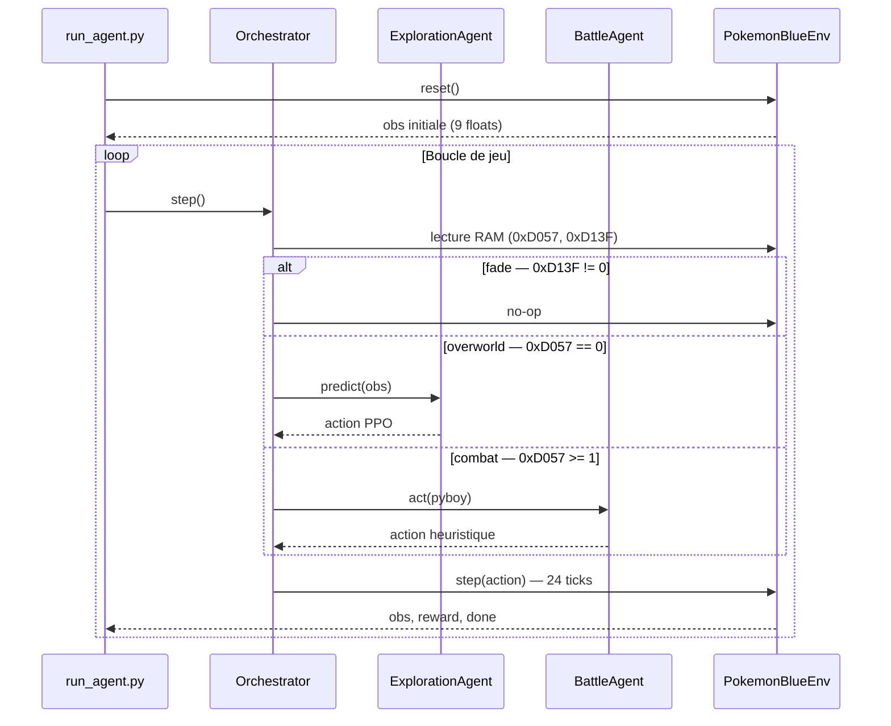

# 🏗️ Architecture — Pokémon Blue AI

Architecture RAM-only : les observations viennent exclusivement de la mémoire Game Boy.
Aucune dépendance vision/YOLO.

---

## 🧩 Vue d'ensemble



---

## 📦 Modules

### `src/emulator/pokemon_env.py` — Gymnasium Environment

Interface entre PyBoy et Stable Baselines3.

**Observation** (9 floats, tous en [0, 1]) :

| Index | Variable | Source RAM |
| :---: | :--- | :--- |
| 0 | `player_x` | `0xD362 / 255` |
| 1 | `player_y` | `0xD361 / 255` |
| 2 | `map_id` | `0xD35E / 255` |
| 3 | `direction` | `0xD35D` → {0, 0.33, 0.66, 1} |
| 4 | `hp_pct` | `0xD16C-D / 0xD18C-D` |
| 5 | `battle_status` | `0xD057 / 2` |
| 6 | `waypoint_x` | cible X / 255 (0 si map différente) |
| 7 | `waypoint_y` | cible Y / 255 (0 si map différente) |
| 8 | `badges_pct` | `popcount(0xD356) / 8` |

**Action space** : `Discrete(6)` — up, down, left, right, a, b

**Reward design** :

| Signal | Valeur | Condition |
| :--- | :--- | :--- |
| Pas de base | `-0.01` | Toujours |
| Distance shaping | `(prev_dist − curr_dist) × 0.1` | Même map que le waypoint |
| Nouvelle zone | `+1.0` | Première visite d'une map |
| Waypoint intermédiaire | `+2.0` | Waypoint chaîné franchi |
| Stuck penalty | `-0.05` | > 600 visites sur la même case |
| Death | `-1.0` | HP → 0 pendant un combat |
| Opponent level | `+opp_lvl × 0.2` | Fin de combat (victoire) |

---

### `src/agent/exploration_agent.py` — PPO Navigation

Wraps SB3 PPO avec un curriculum de 13 waypoints (Bourg Palette → Brock).

- **Training** : `ExplorationAgent(env_factory)` + `agent.train()`
- **Inference** : `ExplorationAgent.from_model(ppo_model, waypoints)` (pas de VecEnv)
- **Two-phase** : Phase 1 exploration large (`max_steps×5`), Phase 2 fine-tune (budget serré)
- **Chaining** : Plusieurs waypoints en un seul épisode via `--chain 0 1`

---

### `src/agent/battle_agent.py` — Battle Heuristic

Agent heuristique (pas de RL) pour les combats.

- Lit HP joueur/ennemi, types, PP depuis la RAM
- Sélectionne le move avec type advantage (table Gen 1)
- Utilise une Potion si HP < 30%
- Navigation menus combat Gen 1 (séquence de boutons)

---

### `src/agent/orchestrator.py` — State Machine

Lit la RAM pour router vers le bon agent :

```
0xD13F != 0  →  Attendre (fade en cours)
0xD11C != 0  →  Auto-skip dialog (press A)
0xD057 == 0  →  ExplorationAgent (overworld)
0xD057 >= 1  →  BattleAgent (combat)
```

---

### `src/utils/`

| Fichier | Description |
| :--- | :--- |
| `create_checkpoints.py` | Génère des save states : `--auto` (recettes headless) ou `--manual` (SDL2) |
| `debug_visualizer.py` | Overlay RAM en temps réel (sprites, tiles, position, badges) |

---

## 🔄 Game Loop (inférence)



---

## 🗂️ Organisation des fichiers

```
PokemonBlueExperiments/
├── run_agent.py                 # Point d'entrée principal
├── ROMs/PokemonBlue.gb          # ROM (non versionnée)
├── states/                      # Save states PyBoy (01_chambre … 46_pewter_gym)
├── models/rl_checkpoints/       # Modèles PPO entraînés (.zip)
├── logs/                        # TensorBoard logs
├── mapping.json                 # Sprites & tiles par tileset
├── src/
│   ├── emulator/pokemon_env.py  # Gymnasium environment
│   ├── agent/
│   │   ├── exploration_agent.py # PPO + curriculum waypoints
│   │   ├── battle_agent.py      # Heuristique combat
│   │   └── orchestrator.py      # State machine
│   └── utils/
│       ├── create_checkpoints.py
│       └── debug_visualizer.py
├── tests/
│   └── test_emu.py
└── docs/
    ├── architecture.md          # Ce document
    ├── roadmap.md
    └── ram_map.md
```

---

## 📚 Documents liés

| Document | Description |
| :--- | :--- |
| [ram_map.md](ram_map.md) | Adresses mémoires détaillées |
| [roadmap.md](roadmap.md) | Statut d'avancement et plan |
